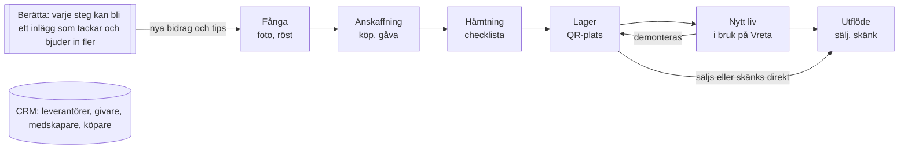

# VRETA – Specifikation R1

5 oktober 2026 · Mattias Seger

> Exporterad från Claude Docs-dokumentet *VRETA – Specifikation R1*. Vid skillnad gäller den senast uppdaterade versionen; uppdatera denna fil när specen ändras.

## 0. Om dokumentet

R1 är den första versionen av VRETA som ska användas på riktigt. Den ersätter V1 (5 oktober 2026) och V2.0 som underlag för design, implementation och test. V1 och V2.0 arkiveras: vid motsägelse gäller detta dokument.

Dokumentet beskriver **vad** som ska byggas och **hur det ska upplevas**, inte exakt kod. Krav har ID:n (INV, FR, NFR, AC) så att de kan läggas direkt i backlog, testplan och agentuppdrag. Ingen utvecklare eller AI-agent får hitta på egna statusnamn, entiteter eller flöden utanför dokumentet – oklarheter läggs som öppen fråga (avsnitt 16).

### Viktigaste förändringarna mot V2.0

| Område | V2.0 | R1 |
| --- | --- | --- |
| Berättande | Modul som byggs sent | Grundprincip från dag ett; råmaterial fångas redan vid registrering |
| Inköp | Saknades | Eget anskaffningsflöde (Acquisition) och leverantörsprofiler |
| CRM | Personkort med bidrag | Fullt relations-CRM med flera roller, pipelines för in- och utflöde, sociala profiler |
| Marknadsplats | Annonspaket utan API | Tre publiceringsvägar: API, webbläsaragent via MCP, manuell delning |
| Partier | Ett status per parti | Kvantitet fördelad på plats och status; delning av partier |
| Tillståndsmaskiner | Objekt, projekt, behov, annons, innehåll | Kompletta övergångstabeller inkl. hämtning, uppgift, intressent och vägen tillbaka från "i bruk" |
| AI | Agentroller | Verifieringskö ("Att granska") och tydlig skillnad mellan förslag och fakta |
| Integritet | Fyra nivåer, odefinierade | Fyra definierade nivåer, EXIF-rensning, samtycke fångas vid första kontakt |
| Omfattning | Brett P0 | Smal kärna: inflöde → objektets liv → utflöde, med CRM och berättande längs hela vägen |
| Kontext | Oklart privat/näring | Privat verksamhet: ingen bokföring, men enkel årssammanställning av köp och försäljning |

Tillagt efter första utkastet: en egen fastighetskarta för Vreta med Google Maps för omvärlden (7.6), fullt talstöd med röstläge (7.5) och chatboten Fråga Vreta som känner till allt innehåll (11.6).

## 1. Produktdefinition

VRETA är ett digitalt operativsystem för en regenerativ plats: ett inköps- och lagersystem för återbruk, ett relations-CRM och ett berättarverktyg i samma app. Allt bygger på samma data: det som registreras en gång kan följas, planeras och berättas om.

**Kärnformulering:** Fånga verkligheten medan den händer. Följ vad saker och människor bidrar till. Berätta historien och bjud in fler.

### 1.1 Problem som R1 löser

1. Fynd, annonser, kontakter, bilder och meddelanden ligger utspridda i Blocket, Facebook, Messenger, kamerarullen och minnet.
2. Det är svårt att veta vad som finns i lager, var det ligger och vad det kostade.
3. Det går inte att se vad återbrukade saker faktiskt blev och var de hamnade.
4. Människor som bidragit med material, tid och kunskap försvinner ur historiken.
5. Bra berättelser uppstår varje dag men blir aldrig publicerade, eftersom det tar för lång tid att samla bilder och fakta i efterhand.
6. Överskott ligger kvar eftersom det är omständligt att skriva och lägga upp annonser.

### 1.2 Användare i R1

| Roll | Vem | Behörighet i R1 |
| --- | --- | --- |
| Ägare | Du – driver Vreta och återbruket | Allt, inklusive publicering och samtycken |
| Medhjälpare | Familj eller nära vänner som hjälper till | Registrera fynd, hämtningar, observationer och bidrag; inga publiceringar |
| Läsare | Den som vill följa arbetet internt | Läsa internt material |
| Bidragsgivare (extern) | Givare, säljare, köpare, följare | Ingen inloggning; nås via sociala medier och en publik "Bidra"-sida |

### 1.3 Kontext: privat verksamhet

VRETA R1 används för privat verksamhet. Det innebär:

- Ingen bokföring, moms eller fakturering.
- Köppris, försäljningspris, betalsätt och kvitto sparas per objekt, och en **årssammanställning** visar köp, försäljning och resultat per kalenderår som stöd för deklarationen.
- Statistiken gör det lätt att se om omfattningen närmar sig näringsverksamhet. Det är en upplysning, inte en juridisk bedömning.
- Datamodellen tillåter att ägaren senare blir en förening eller ett bolag utan ombyggnad.

### 1.4 Mål för R1

1. Ett fynd ska kunna registreras på under 60 sekunder med foto och röst.
2. Varje objekt ska ha känd källa, känd plats och känd status.
3. Ett lagerobjekt ska kunna bli en annons på Blocket eller Facebook Marketplace på under 3 minuter.
4. Varje registrerat ögonblick ska kunna bli ett delbart inlägg på under 2 minuter.
5. Alla som bidragit ska synas – med deras samtycke – och kunna bjudas in att bidra igen.

### 1.5 Icke-mål i R1

- Bokföring, fakturering och ekonomisystem.
- Full GIS, CAD/BIM eller digital tvilling.
- Oövervakad automatisk publicering. Varje extern publicering bekräftas av en människa.
- Massannonsering eller skrapning av marknadsplatser.
- Inloggning för externa bidragsgivare.
- Sensorer och IoT.
- Juridisk hantering av samtycke; appen stödjer men ersätter inte ansvaret.

## 2. Principer och invarianta regler

Fem produktprinciper styr alla designval; de invarianta reglerna är tvingande och ska ha automatiska tester.

### 2.1 Produktprinciper

1. **Dokumentera en gång, använd många gånger.** En verklig händelse registreras en gång och syns i alla relevanta journaler, kort och berättelser.
2. **Berättande är en grundfunktion.** Varje skärm med något som hänt har en "Berätta"-knapp. Registreringen frågar efter det som gör en historia: varför, före-bild, en mening från personen.
3. **Människor är en del av systemet.** Personer är inte kontakter i ett register utan leverantörer, givare, medskapare, köpare och följare i ett ekosystem.
4. **AI föreslår, människan bestämmer.** AI fyller i, kopplar och skriver utkast. Fakta blir fakta först när du godkänt dem, och inget lämnar appen utan ditt klick.
5. **Mobil först, i fält.** Det viktigaste flödet sker med en hand, ute, ibland utan täckning.

### 2.2 Invarianta regler

| ID | Regel |
| --- | --- |
| INV-01 | En verklig händelse lagras en gång som Event och visas i flera journaler via länkar, aldrig som kopior. |
| INV-02 | AI får aldrig skriva över verifierad data. AI-förslag lagras som förslag tills en människa godkänner. |
| INV-03 | Data med synlighet `private` får aldrig ingå i publikt innehåll, annonser, exporter till tredje part eller i kontext som skickas till AI för publik text. |
| INV-04 | Varje extern publicering (inlägg, annons, meddelande) kräver en uttrycklig bekräftelse av en behörig användare, även när en agent utför den. |
| INV-05 | Ett objekt med status `in_use` måste ha datum och plats (zon eller byggnad). |
| INV-06 | En person som nämns eller syns i publikt innehåll måste ha samtycke för just det (namn, bild, bidrag) eller ett sparat godkännande för just det inlägget. |
| INV-07 | Bilder som lämnar appen har platsdata (EXIF/GPS) och annan metadata borttagen. |
| INV-08 | Kärndata raderas aldrig hårt i normalflödet; den arkiveras så att historik och proveniens består. Hård radering sker bara via GDPR-radering. |
| INV-09 | Statusbyten, samtyckesändringar, publiceringar och agentåtgärder loggas i AuditEntry. |
| INV-10 | AI-svar som påstår något om egen data länkar till de entiteter svaret bygger på. |
| INV-11 | Summan av kvantiteter i ett partis fördelning är alltid lika med partiets totala kvantitet. |
| INV-12 | En annons publiceras aldrig med exakt adress, givarens namn eller lagerplats. Platsen anges på ortsnivå. |
| INV-13 | Kontaktuppgifter och CRM-anteckningar är `private` som standard och kan inte sättas till `public`. |

## 3. Omfattning i R1

R1 bygger hela kärnflödet **inflöde → objektets liv → utflöde**, med CRM och berättande längs hela vägen. Plats- och systemplanering finns i en enkel form; den fulla regenerativa modellen kommer i R2.

### 3.1 Prioritering

| Område | P0 – måste finnas i R1 | P1 – i R1 om tid finns | R2 och senare |
| --- | --- | --- | --- |
| Fånga | Global +, foto, röst, text, skärmdump; diktering i alla fält; röstläge; AI-förslag; "Att granska"-kö; offline-kö | Vidarebefordrade bevakningsmejl som fynd | Automatisk bildigenkänning av art/material |
| Inköp | Acquisition med pris, betalsätt, kvitto; leverantörsprofil | Återkommande källor med påminnelser | Pris­historik och marknadsvärde |
| Objekt | Object, ObjectBatch med fördelning, status, proveniens, tidslinje | Klimatnytta (CO₂e) per objekt | Materialpass |
| Hämtning och lager | Pickup med checklista; hierarkisk lagerplats; QR-etikett per lagerplats | Ruttförslag för flera hämtningar | Tiptapp-integration |
| Nytt liv | UsageEvent: monterad, planterad, installerad, flyttad, demonterad | Påminnelse om uppföljning ("ett år senare") | Fasta fotopunkter med automatisk jämförelse |
| Utflöde | Annons (sälja, skänka, byta, söker); annonspaket; manuell publicering; intressentkö | Webbläsaragent via MCP | Direktintegration där API finns |
| CRM | Person, organisation, roller, kontakthistorik, bidrag, samtycke, sociala profiler | Tack-påminnelser, ömsesidighet | Publik bidragsportal med inloggning |
| Berätta | Berätta-knapp överallt; utkast per kanal; delningsmeny; Privacy Guard | Berättelseförslag från AI; innehållskalender | Direktpublicering till Facebooksida och Instagram |
| Plats | Site, zoner, byggnader; egen fastighetskarta (Vretakartan) med eget ortofoto, zoner, byggnader och nålar, offline; Google Maps för hämtningar och navigering | Projekt med behov (Need) och efterlysning | Systemfunktioner med bedömning, NU/PLAN-karta |
| AI | Capture, chatboten Fråga Vreta med källor och röstläge, annonstext, berättelseutkast | Dubblettförslag | Planeringsagent |
| Drift | Auth, roller, audit, export, backup | Årssammanställning köp/försäljning | – |

### 3.2 Vad som medvetet väntar

- **Systemfunktioner och bedömningar** (mat, vatten, energi m.fl.) väntar till R2. R1 sparar ändå zon och byggnad på allt, så att historiken kan kopplas till funktioner i efterhand.
- **Projekt och behov** är P1. Om de inte hinns med kan objekt ändå taggas med ett projektnamn som senare blir en riktig Project-entitet.
- **Direktpublicering via API** väntar. R1 löser publicering med delningsmeny och, i P1, webbläsaragent.

## 4. Kärnprocesser

R1 har nio kärnprocesser. Var och en slutar i ett tydligt tillstånd och skapar en Event, så att den syns i journaler och kan berättas om.

*Kärnflödet i R1: CRM och Berätta följer med i alla steg.*

Ett objekt kan gå tillbaka från nytt liv till lager och vidare ut. Varje steg skapar en händelse som kan berättas, och berättelserna drar in nya bidrag och tips.

### 4.1 Fånga (alla flödens startpunkt)

1. Användaren trycker på **+** och tar foto, spelar in röst, skriver eller klistrar in en annonslänk eller skärmdump.
2. Inspelningen sparas lokalt direkt, även offline, som ett **Capture**.
3. När nät finns tolkar Capture Agent innehållet och föreslår entiteter: objekt eller parti, person, plats, pris, antal, mått, deadline, transportbehov.
4. Appen visar förslaget direkt om nät finns; annars hamnar det i **Att granska**.
5. Användaren godkänner, ändrar eller avvisar per fält. Osäkra fält är markerade.
6. Vid godkännande skapas entiteterna, en Event och vid behov en uppföljningsuppgift.
7. Appen erbjuder tre valfria berättarfångster: *Varför är detta intressant?* (en mening), *Före-bild?* (foto) och *Markera som bra ögonblick*.

### 4.2 Anskaffning (inköp, gåva, byte)

1. Ett fynd blir en **Acquisition** kopplad till objekt eller parti och motpart (person eller organisation).
2. Användaren för dialogen: kontaktad → förhandlar → överenskommet. Meddelanden kan klistras in eller dikteras och kopplas till personen.
3. Vid överenskommelse sparas typ (köp, gåva, byte, lån, arbete mot material), pris, betalsätt och tidsfönster för hämtning.
4. En Pickup skapas automatiskt med objekten och motpartens adress.
5. Efter hämtning markeras anskaffningen som mottagen och betald; kvitto eller Swish-skärmdump bifogas som media.
6. Motparten får rollen leverantör eller givare och en kontakthistorikpost.

### 4.3 Hämtning

1. Pickup har datum, tidsfönster, från-adress, kontaktperson, objekt och resurser (fordon, släp, spännband, bärhjälp).
2. En checklistmall väljs (t.ex. "Stora fönster", "Växter") och kan justeras.
3. På plats: foton före/under/efter, diktering och avbockning, även offline.
4. Vid avslut anges mottagning per objekt: allt mottaget, delvis eller avvikelse.
5. Objekten får status `collected`, en Event `pickup.completed` skapas och appen frågar direkt om lagerplats.

### 4.4 Lagring

1. Användaren väljer lagerplats i trädet (Vreta → Garage → Vänster vägg → Hylla 3) eller scannar QR-etiketten på platsen.
2. Ett parti kan fördelas på flera platser (300 tegel på pall A, 100 i förrådet).
3. Objekten får status `stored`. Flytt mellan lagerplatser loggas men skapar ingen ny journalhändelse om inte användaren vill.

### 4.5 Nytt liv

1. Från objektet väljer användaren **Använd** och typ: monterad, planterad, installerad, inbyggd, renoverad, flyttad, demonterad.
2. Plats (zon eller byggnad) och datum krävs; projekt, foto och anteckning är valfria.
3. För ett parti anges kvantitet; resten ligger kvar i lager.
4. Objektet får status `in_use`, en UsageEvent och en Event skapas och syns i objekt-, plats- och projektjournal.
5. Appen föreslår en berättelse ("Före/efter") och, för växter, en uppföljning om tre månader.
6. Ett objekt kan senare demonteras och gå tillbaka till lager eller ut via annons; tidigare liv finns kvar i tidslinjen.

### 4.6 Utflöde (sälja, skänka, byta)

1. Från ett lagerobjekt eller parti väljer användaren **Lägg ut** och typ: sälja, skänka, byta eller låna ut.
2. Marketplace Agent skapar annonspaket per kanal: rubrik, text, kategori, prisförslag, mått och utvalda bilder utan platsdata.
3. Användaren granskar och väljer publiceringsväg per kanal: manuell (delningsmeny, kopiera) eller agent (P1).
4. Annonslänken sparas; annonsen får status `published`.
5. Intressenter registreras som Leads, i köordning, kopplade till personer i CRM.
6. Vid överenskommelse reserveras objektet; vid överlämning blir objektet `sold`, `donated` eller `exchanged`, annonsen stängs och pris och köpare sparas.
7. Appen påminner om att ta ner annonsen i alla kanaler och föreslår en berättelse om vart objektet tog vägen.

### 4.7 Berätta

1. Användaren trycker **Berätta** på ett objekt, en person, en händelse, en zon eller en tidsperiod.
2. Användaren väljer mål (t.ex. före/efter, tacka, efterlys, visa vad som hänt) och kanaler.
3. Privacy Guard bygger en rensad kontext; Story Agent skriver utkast per kanal och föreslår bilder.
4. Publiceringsgranskningen visar källor, personer som nämns eller syns och deras samtycke.
5. Användaren redigerar och godkänner, och delar via delningsmenyn med text och bilder.
6. Användaren markerar inlägget som delat och klistrar gärna in länken. Inlägget syns i journalen.

### 4.8 Relation och tack

1. Bidrag (material, tid, kunskap, transport, verktyg, kontakter, mat, omsorg) registreras på en person och kopplas till objekt, händelse eller projekt.
2. Vid första kontakten frågar appen om samtycke: namn, bild och bidrag – ja, nej eller fråga varje gång.
3. När ett objekt från personen får nytt liv föreslår appen att tacka eller visa personen resultatet.
4. Tack kan vara ett publikt inlägg (med samtycke) eller ett privat meddelande med bild.
5. Ömsesidighet (vad Vreta gett tillbaka) kan registreras.

### 4.9 Platsjournal

1. Foto eller röst registreras med zon som observation (t.ex. vatten, blomning, skada, skörd, byggnation).
2. Observationen syns i plats- och zonjournal och kan kopplas till objekt eller projekt.
3. Beslut kan journalföras med bakgrund, alternativ och motiv.
4. Journalen kan sammanfattas per vecka, månad eller säsong och bli en berättelse.

## 5. Tillståndsmaskiner

Alla statusar nedan är de enda tillåtna; koden ska använda exakt dessa namn. Övergångar utanför tabellerna nekas av servern, men ägaren kan korrigera historik med en audit-loggad override. Svenska etiketter i gränssnittet står inom parentes.

### 5.1 Objekt (Object och varje fördelningsrad i ett parti)

| Från | Tillåtna övergångar |
| --- | --- |
| `discovered` (Upptäckt) | `contacted`, `reserved`, `collected`, `declined`, `lost` |
| `contacted` (Kontaktad) | `reserved`, `collected`, `declined`, `lost` |
| `reserved` (Reserverad) | `pickup_planned`, `collected`, `declined`, `lost` |
| `pickup_planned` (Hämtning planerad) | `collected`, `reserved`, `lost` |
| `collected` (Hämtad) | `stored`, `processing`, `in_use`, `listed` |
| `stored` (I lager) | `processing`, `in_use`, `listed`, `discarded` |
| `processing` (Renoveras) | `stored`, `in_use`, `listed`, `discarded` |
| `in_use` (I bruk) | `stored` (demonterad), `processing`, `in_use` (flyttad), `listed`, `discarded` |
| `listed` (Utannonserad) | `stored` (annons stängd), `reserved_out`, `in_use` |
| `reserved_out` (Reserverad för köpare) | `listed`, `sold`, `donated`, `exchanged`, `lent` |
| `lent` (Utlånad) | `stored`, `in_use` |

Terminala: `declined` (Avstått), `lost` (Missat), `sold` (Såld), `donated` (Skänkt), `exchanged` (Bytt), `discarded` (Kasserad).

Genvägar är tillåtna där de speglar verkligheten: ett fynd som köps och tas med direkt går `discovered → collected`. Mellanliggande status loggas inte i efterhand.

Växter och annat levande material följer samma maskin; `in_use` visas som "Planterad" och har en egen hälsostatus (`establishing`, `healthy`, `struggling`, `dead`).

### 5.2 Anskaffning (Acquisition)

`lead → contacted → negotiating → agreed → received → settled`

Avbrott: `declined` eller `lost` från alla icke-terminala. `settled` betyder mottaget och betalt (eller gåva kvitterad).

### 5.3 Hämtning (Pickup)

`planned → confirmed → in_progress → completed`

`cancelled` från `planned`/`confirmed`. `completed` kräver mottagningsstatus per objekt: `received`, `partial` eller `deviation`.

### 5.4 Annons (Listing)

`draft → ready → published → agreed → completed → archived`

`published` kan gå tillbaka till `ready` (annons nedtagen för ändring). `withdrawn` från alla utom `completed`. Status per kanal följs separat i ChannelPost: `not_posted`, `posted`, `removed`.

### 5.5 Intressent (Lead)

`new → replied → viewing_booked → agreed → completed`

Avbrott: `no_show`, `lost`, `rejected`. Leads i en annons har köordning; när en går ur föreslår appen nästa.

### 5.6 Innehåll (ContentItem)

`idea → draft → review → approved → shared → archived`

`rejected` från `draft` och `review`. `shared` sätts manuellt efter delning eller automatiskt av agent med länk. `scheduled` läggs till i P1 med innehållskalendern.

### 5.7 Uppgift (Task)

`open → in_progress → done`

`snoozed` (med nytt datum) och `cancelled` från `open`/`in_progress`.

### 5.8 AI-förslag (Proposal)

`pending → accepted | partially_accepted | rejected`

`expired` efter 30 dagar utan åtgärd; originalinspelningen finns kvar.

## 6. Domänmodell

R1 har drygt 30 entiteter i sex grupper; alla delar gemensamma metadata och kopplas via länktabeller i stället för kopior. Relationsdatabasen är källa till sanningen för aktuellt tillstånd; Event är domänhistorik och AuditEntry teknisk logg.

### 6.1 Gemensamma fält på alla kärnentiteter

`id` (UUID), `site_id`, `created_at`, `created_by`, `updated_at`, `updated_by`, `archived_at`, `visibility`, `source_type` (manual, ai\_capture, marketplace\_import, email\_import, agent, system), `source_ref`, `tags`.

AI-extraherade fält sparas med `confidence` (0–1) och `verified` (sant/falskt) per fält i en fältmetadata-struktur, så att gränssnittet kan visa vad som är förslag.

### 6.2 Entiteter

| Grupp | Entitet | Ansvar | Viktiga fält |
| --- | --- | --- | --- |
| Plats | Site | Platsen, t.ex. Vreta / Villa Solgläntan | namn, adress (private), geometri |
| Plats | Zone | Delområde: trädgård, odling, lagerzon | namn, typ, geometri, status (existing/planned/removed) |
| Plats | Structure | Byggnad eller anläggning | namn, typ, zone\_id, geometri, status |
| Plats | StorageLocation | Hierarkisk lagerplats | namn, parent\_id, structure\_id, qr\_code |
| Resurser | Object | Individuellt spårbar sak eller växt | titel, kategori, beskrivning, material, mått, vikt, ålder/period, skick (1–5), status, living\_material, art/sort, hälsostatus, uppskattat värde |
| Resurser | ObjectBatch | Parti av likartat material | samma som Object + total\_quantity, unit |
| Resurser | BatchAllocation | Del av ett parti med egen status och plats | batch\_id, quantity, status, storage\_location\_id eller zone/structure |
| Resurser | Category | Hierarkisk kategori med emissionsfaktor (P1) | namn, parent\_id, co2e\_per\_kg |
| Flöde | Acquisition | Hur en resurs kom in | typ (purchase/gift/exchange/loan/work\_trade), motpart, pris, betalsätt, status, källannons-URL |
| Flöde | Pickup | Hämtning med checklista | datum, tidsfönster, från-adress (private), resurser, status |
| Flöde | PickupItem | Objekt eller partidel i en hämtning | pickup\_id, object/batch, quantity, mottagningsstatus |
| Flöde | ChecklistTemplate / ChecklistItem | Återanvändbara checklistor | namn, rader, avbockad |
| Flöde | UsageEvent | Nytt liv: monterad, planterad m.m. | typ, datum, zon/byggnad, projekt, kvantitet, anteckning |
| Flöde | Listing | Annons eller efterlysning | typ (sell/give/exchange/lend/wanted/help\_wanted), objekt/parti/behov, pris, status |
| Flöde | ChannelPost | Annonsens version per kanal | listing\_id, kanal, text, bilder, extern URL, extern status, publiceringsväg |
| Flöde | Lead | Intressent på en annons | listing\_id, person\_id, köplats, bud, status |
| Flöde | Disposal | Hur en resurs gick ut | typ (sold/donated/exchanged/discarded), motpart, pris, betalsätt, datum |
| Människor | Person | Människa i relation till Vreta | namn, smeknamn, kontaktuppgifter (private), ort, roller, hur vi träffades, sociala profiler |
| Människor | Organization | Företag, förening, kommun | namn, typ, kontakt (private) |
| Människor | Interaction | Kontakthistorik: samtal, meddelande, möte | person\_id, kanal, datum, sammanfattning (private) |
| Människor | Contribution | Bidrag till Vreta | person\_id, typ, beskrivning, mängd/tid, kopplingar |
| Människor | ReciprocityEntry | Vad Vreta gett tillbaka | person\_id, typ, beskrivning, datum |
| Människor | ConsentPolicy | Publiceringssamtycke | person\_id, namn, bild, bidrag (yes/no/ask), datum, hur samtycket gavs |
| Historik | Event | Faktisk händelse | event\_type, occurred\_at, recorded\_at, zon, sammanfattning, anteckning, berättarvärde (flagga) |
| Historik | EventLink | Koppling Event ↔ valfri entitet | event\_id, entity\_type, entity\_id, roll |
| Historik | Observation | Iakttagelse om plats eller natur | typ, zon, beskrivning, uppföljningsdatum |
| Historik | Decision | Beslut | fråga, alternativ, val, motiv, senare utfall |
| Berätta | ContentItem | Inlägg eller berättelse | mål, källor, status, godkänd av, delad URL |
| Berätta | ChannelVariant | Inläggets version per kanal | content\_id, kanal, text, bildurval, CTA |
| Berätta | StoryNote | Råmaterial för berättelser | entitet, typ (varför/citat/ögonblick), text eller ljud, samtycke för citat |
| Gemensamt | Media | Foto, video, ljud, dokument | original, derivat, EXIF (private), fotograf, personer i bild, visibility |
| Gemensamt | Capture / Proposal | Råinspelning och AI-förslag | rådata, föreslagna entiteter, status |
| Gemensamt | Task | Uppgift med datum | titel, förfallodatum, kopplingar, status |
| Gemensamt | AuditEntry | Teknisk logg | vem, vad, när, före/efter |
| P1 | Project, Need, NeedFulfillment | Projekt och behov med uppfyllelsegrad | se 6.4 |

### 6.3 Partier och fördelning

Ett parti (400 tegel, 12 rhododendron) har en total kvantitet som fördelas på BatchAllocation-rader. Varje rad har egen status och egen plats. Exempel:

| Rad | Kvantitet | Status | Plats |
| --- | --- | --- | --- |
| A | 250 | `in_use` | Orangeriet, södra muren |
| B | 120 | `stored` | Garage → Pall A |
| C | 30 | `sold` | – (köpare i CRM) |

När användaren registrerar nytt liv, flytt eller försäljning av en del delas raden: kvantiteten dras från källraden och en ny rad skapas. INV-11 garanterar att summan alltid stämmer. Partiets visade status är en sammanfattning ("250 i bruk, 120 i lager, 30 sålda").

### 6.4 Viktiga relationer och regler

- **Objektets aktuella plats** = senaste UsageEvent om status är `in_use`, annars aktuell StorageLocation. Platsen lagras denormaliserat på objektet och uppdateras i samma transaktion som händelsen.
- **UsageEvent, Pickup, Acquisition, Disposal och Contribution skapar alltid en Event** med EventLinks till alla berörda entiteter. De är specialiserade poster; Event är den gemensamma historiken.
- **Person ↔ objekt**: via Acquisition (leverantör/givare), Disposal (köpare/mottagare) och Contribution.
- **Media** kan länkas till valfri entitet och har egen synlighet. En bild på en person ärver aldrig högre synlighet än personens bildsamtycke.
- **Project (P1)** kopplas till zon/byggnad och har Needs. NeedFulfillment kopplar en kvantitet till ett objekt, parti eller bidrag, och behovets status räknas fram från summan ("1 020 av 1 500 tegel").

## 7. Användargränssnitt

Gränssnittet är byggt för tumme och fält på mobilen och för överblick på datorn. Varje vy svarar på tre frågor: vad är detta, vad har hänt, och vad är nästa steg?

### 7.1 Navigation

**Mobil (nedre fält):** Idag · Saker · **+** · Människor · Platser. Fråga nås från den runda knappen som finns på alla skärmar.

Saker, människor och platser är tre olika delar som är beroende av varandra: **saker** är det som hanteras, **människor** hanterar dem och har relationer med varandra och med Vreta, och **platser** är där det sker fysiskt. Detaljsidorna hör till sin del (objekt och hämtningar till Saker, personkort till Människor, lager, zoner och journal till Platser).

| Flik | Innehåll |
| --- | --- |
| Idag | Nästa steg: att granska, hämtningar, förfallna uppgifter, intressenter som väntar svar, berättelseförslag |
| Saker | Objekt och partier (lista/rutnät) med filter på status och plats; sakernas väg in och ut: inköp, hämtningar och annonser |
| + | Global fångst, alltid tillgänglig |
| Människor | Personer med roller, samtycke, kontakthistorik, bidrag och ömsesidighet |
| Platser | **På Vreta:** karta, zoner och byggnader, och det som sker där – förvaring (lager), projekt (byggen, planteringar) och observationer (djur, växter m.m.) med journal. **Utanför:** platser som loppisar, hämtställen och återvinningscentraler, och orterna där saker hämtas, köps och lämnas |
| Fråga | Chatboten Fråga Vreta: sök, frågor och uppdrag i text eller tal (se 11.6) |

**Dator:** vänsterkolumn med Idag, Saker, Människor, Platser och Fråga samt Fånga och Inställningar. Listor och detaljer visas sida vid sida.

**Projekt** (Project) är egna poster med namn, slag, status (idé, planerat, pågår, vilar, klart), zon eller byggnad och beskrivning. Nytt liv och bidrag kopplas med project_id; ett nytt projektnamn i formulären blir ett projekt. Projektsidan visar behov, saker, människor och projektjournal, och projektets yta kan ritas på Vretakartan (eget lager "Projekt").

**Behov** (Need) hör till ett projekt: rubrik, antal och enhet (antal kan lämnas tomt). NeedFulfillment kopplar en kvantitet till en sak (eller inget, t.ex. sten från egna marken). Hur långt behovet kommit räknas fram ur summan ("1 020 av 1 500 tegel") och lagras aldrig. Varje uppfyllelse blir en händelse i projektjournalen; när behovet är fyllt markeras händelsen som värd att berätta. Appen föreslår saker i lager som passar behovet, och ett behov kan efterlysas – annonsen kopplas tillbaka till behovet.

**Fråga Vreta** har verktygen `projects`, `project_overview`, `open_needs` och `place_overview` ("Hur går det med orangeriet?", "Vad behöver vi till orangeriet?", "Vad har vi köpt på Återbruket?"). Adresser till platser utanför Vreta läses aldrig av chatboten.

**Platser utanför Vreta** (ExternalPlace) har namn, slag, ort och en privat adress. Inköp, hämtningar och avslut kan kopplas till en plats (place_id), så att man ser vad som kom därifrån och vad som lämnades där. Orten är på kommunnivå och får synas; adressen syns bara för ägare och medhjälpare (INV-12, INV-13). Objektsidan har en flik Platser med var saken är på Vreta och var den kom ifrån och tog vägen.

### 7.2 Designprinciper

1. **En hand, tre tryck.** Ett fynd ska kunna sparas med tre tryck: +, foto, spara. Allt annat kan fyllas i senare.
2. **Röst och bild först.** Mikrofonknappen finns i alla textfält, och de viktigaste flödena kan göras med rösten (se 7.5).
3. **Förslag syns som förslag.** AI-ifyllda fält har streckad kant och en liten gnista; ett tryck godkänner, ett svep avvisar.
4. **Nästa steg överst.** Varje detaljsida har en primär knapp för det mest sannolika nästa steget (t.ex. "Planera hämtning", "Välj lagerplats", "Använd").
5. **Berätta överallt.** Berätta-knappen finns i övre hörnet på objekt, personer, händelser, zoner och journaler.
6. **Tidslinje och karta** återkommer som visuella modeller på alla detaljsidor.
7. **Synlighet syns.** Ett lås (privat), ett hus (internt), en länk (delbart) eller en jordglob (publikt) står vid fält och bilder.
8. **Offline syns.** En diskret molnsymbol visar synkstatus; inget går förlorat.

### 7.3 Skärmar

**S1 Idag**

- Överst: kort "Att granska" med antal AI-förslag, och dagens hämtningar med tid och adress.
- Sedan: uppgifter sorterade efter förfallodatum, intressenter som väntar svar, objekt som legat i lager länge (över 12 månader).
- Sist: "Att berätta" – 1–3 föreslagna berättelser med bild (P1: AI-genererade, P0: senaste markerade ögonblick).

**S2 Fångst (+)**

- Öppnar kameran direkt. Längst ner: röst, text, klistra in länk, välj från galleri.
- Efter foto: håll in mikrofonen och berätta ("Sex gjutjärnsfönster, Anders i Ockelbo, 200 kr styck, måste hämtas före november, behöver släp").
- Snabbval av typ: Fynd, Person, Observation, Bidrag, Annat (AI avgör).
- Spara → förslagsvy (online) eller bekräftelse "Sparat, granskas senare" (offline).

**S3 Förslagsvy (granska)**

- Kort per föreslagen entitet: Objekt (6 st gjutjärnsfönster), Person (Anders, Ockelbo – ny eller befintlig?), Anskaffning (köp, 1 200 kr), Uppgift (hämta före 1 nov).
- Varje fält kan godkännas, ändras eller tas bort. Dubblettförslag visas som "Samma som Anders Lind?".
- Botten: Godkänn alla · Spara utkast · Släng.
- Efter godkännande: berättarfångst (varför, före-bild, markera ögonblick) som ett diskret, hoppbart steg.

**S4 Objektsida**

- Bildkarusell överst med status som etikett och synlighetsikoner.
- Rubrik, kategori, antal (för parti: fördelningsstapel "250 i bruk · 120 i lager · 30 sålda").
- Primär knapp för nästa steg; sekundära: Använd, Lägg ut, Flytta, Berätta.
- Flikar: **Resa** (tidslinje från fynd till nu, med bilder) · **Fakta** (mått, material, skick, värde) · **Människor** (från vem, till vem, vem hjälpte) · **Ekonomi** (köpt för, sålt för).
- "Var finns den nu?" visas alltid med karta eller lagerväg.

**S5 Personkort**

- Namn, bild (om samtycke), roller som etiketter (Leverantör, Givare, Medskapare, Köpare, Följare).
- Snabbknappar: Ring, Meddelande, Logga kontakt, Registrera bidrag, Tacka.
- Samtyckesrad: namn ✓ · bild ? · bidrag ✓, tryck för att ändra.
- Flikar: **Relation** (tidslinje: första mötet, köp, bidrag, tack) · **Objekt** (från och till personen) · **Bidrag och ömsesidighet** · **Anteckningar** (privat).
- "Nästa steg med personen": t.ex. "Visa Anders var fönstren hamnade".

**S6 Hämtning**

- Google Maps-karta med adress, tidsfönster, kontaktknapp och knappen Navigera, som öppnar vägbeskrivning i Google Maps-appen. Röstläget läser upp checklistan.
- Objektlista med antal; checklista som stora kryssrutor.
- Kameraknapp "Före / Under / Efter".
- Avsluta: mottagning per objekt → välj lagerplats.

**S7 Lager**

- Träd som kan fällas ut: Vreta → Garage → Vänster vägg → Hylla 3.
- Varje plats visar innehåll med miniatyrer. QR-scanner i övre hörnet.
- Utskrift av QR-etiketter per plats.

**S8 Annonsstudio**

- Vänster (mobil: överst): bildval med dra-och-släpp-ordning; bilder utan platsdata markeras med ✓.
- Mitten: gemensamma fält – typ, pris, skick, mått, ort.
- Flikar per kanal: Blocket, Facebook Marketplace, (senare fler). Varje flik visar text anpassad för kanalen och vad kanalen stödjer.
- Knappar per kanal: **Dela/kopiera**, **Låt agent publicera** (P1), **Klistra in annonslänk**.
- Under: intressentkö med status och snabbsvar (AI-utkast).

**S9 Berätta-studio**

- Steg 1: välj mål (Berätta historien, Före/efter, Tacka, Efterlys, Visa vad som hänt, Veckans Vreta).
- Steg 2: välj kanaler (Facebook, Instagram, LinkedIn, privat meddelande).
- Steg 3: utkast per kanal med föreslagna bilder; redigera fritt; ton (varm, saklig, kort).
- Steg 4: granskning – källor, personer med samtyckesstatus, varningar i gult.
- Steg 5: Dela (delningsmeny med text och bilder) och markera som delat.

**S10 Vreta (karta och journal)**

- Vretakartan: egen fastighetskarta med eget ortofoto som grund; fastighetsgräns, zoner och byggnader som ytor; nålar för objekt i bruk, observationer och fotopunkter; fungerar offline (se 7.6).
- Tryck på zon: zonkort med objekt, senaste händelser, foton över tid.
- Journalflöde med filter: allt, zon, typ, person, period.

**S11 Fråga Vreta (chatbot)**

- Chattvy med textfält och mikrofon, nås från fliken Fråga och från en flytande knapp på alla skärmar (se 11.6). Korta ord ger filtrerade träffar; frågor ("Var är mässingshandtagen?") ger AI-svar med källkort som går att trycka på.
- Föreslagna frågor: Vad behöver jag följa upp? Vad har legat i lager längst? Vad kan bli bra innehåll denna vecka? Vem har bidragit mest i år?

**S12 Inställningar**

- Kategorier, checklistmallar, lagerplatser, kanaler (med vad varje kanal klarar), användare och roller, export, årssammanställning.

### 7.4 Tillgänglighet och ton

- WCAG 2.2 AA för alla kärnflöden; tryckytor minst 44 × 44 px; fungerar i solljus (hög kontrast).
- Språk: svenska i R1, med strängar förberedda för översättning.
- Ton i gränssnittet: varm, konkret och kort – som en vän som hjälper till, inte ett affärssystem.

### 7.5 Talstöd

Rösten är en fullvärdig inmatning i hela appen, så att du kan arbeta med smutsiga händer, bära saker eller köra bil. R1 har fyra nivåer av talstöd:

| Nivå | Vad det gör | Exempel | Prio |
| --- | --- | --- | --- |
| Diktering | Mikrofonknapp i alla textfält; tal blir text | Beskrivning, anteckning, meddelande till givare | P0 |
| Röstfångst | En inspelning tolkas av Capture Agent till entiteter | "Sex gjutjärnsfönster, Anders i Ockelbo, 200 kr styck" | P0 |
| Röstkommandon | Korta kommandon tolkas till åtgärder via chatboten, med bekräftelse | "Lägg tegelpartiet på pall A", "Bocka av spännband", "Markera hämtningen klar" | P0 |
| Röstläge (handsfree) | Samtal med chatboten: du pratar, den svarar med tal och läser upp | Checklistan vid hämtning, "Vad har jag kvar att göra idag?", uppläsning av ett berättelseutkast | P0 |

**Regler för tal**

- Svenska är huvudspråk; ortnamn, personnamn och materialord ur VRETA:s egen data skickas med som ordlista till taltjänsten för bättre igenkänning.
- Inspelningen sparas alltid som ljudfil (Media, `private`) tillsammans med transkriptionen, så att inget går förlorat om tolkningen blir fel.
- Offline sparas ljudet och transkriberas när nätet kommer tillbaka; diktering i textfält använder telefonens inbyggda taligenkänning som reserv.
- Röstkommandon som ändrar data visar och läser upp en bekräftelse ("Flytta 300 tegel till pall A – ja?"). Publicering och samtyckesändringar kan aldrig bekräftas med enbart röst; de kräver ett tryck.
- Uppläsning använder en svensk röst med justerbar hastighet och kan pausas med ett tryck eller ordet "stopp".
- Mikrofonen är bara aktiv när användaren tryckt på den eller startat röstläge; appen lyssnar aldrig i bakgrunden.

### 7.6 Kartor: Vretakartan och omvärldskartan

Vreta har en egen fastighetskarta, **Vretakartan**, som ligger i systemet och ägs av systemet. Google Maps används bara för det som ligger utanför fastigheten: adresser, hämtningar och navigering.

|  | Vretakartan | Omvärldskartan |
| --- | --- | --- |
| Syfte | Planera, dokumentera och följa det regenerativa systemet på fastigheten | Hitta och ta sig till givare, säljare och köpare |
| Underlag | Eget ortofoto (drönarbild) och/eller fastighetskarta, ritning eller situationsplan, georefererade | Google Maps |
| Lagras | I VRETA:s databas och fillagring | Hos Google; VRETA sparar bara adress och koordinat |
| Fungerar offline | Ja, hela fastigheten laddas ner till telefonen | Nej |
| Detaljnivå | Enskilda rabatter, träd och ledningar (drönarbild med några cm per pixel) | Gatunivå |
| Synlighet | Alltid intern; aldrig publik | Intern |

#### Vretakartans underlag

1. **Grundbild:** ett eget ortofoto från drönare, ett flygfoto eller en skannad fastighetskarta eller ritning. Bilden laddas upp och georefereras genom att användaren pekar ut 3–4 kända punkter (t.ex. hushörn) på bilden och på en referenskarta.
2. **Flera grundbilder över tid:** nya ortofoton kan läggas till med datum, så att fastighetens förändring kan jämföras (t.ex. vår 2026 mot vår 2027) med ett reglage.
3. **Vektorlager:** fastighetsgräns, byggnader, zoner och rabatter, gångar, vatten, ledningar och träd ritas som punkter, linjer och ytor i VRETA och lagras i databasen.

#### Underlag för Vreta i R1

Vretakartan byggs på kommunens baskarta för Vreta 8:35 som grundlager, med situationsplanen för brunn och avlopp som första överlägg. Baskartan är en GeoPDF med inbäddad georeferens, så den kan läsas in utan manuell placering.

| Underlag | Fil | Innehåll | Hur det kommer in i VRETA | Blir |
| --- | --- | --- | --- | --- |
| Baskarta med fältkontroll, Uppsala kommun (upprättad 2021-06-07) | GeoPDF från ArcMap, A3, skala 1:500, SWEREF 99 18 00 / RH 2000 | Fastighetsgräns med gränspunkter, byggnader, höjdkurvor och markhöjder, sockelhöjd, damm, träd, staket, väg, gemensamhetsanläggning, grannfastigheter, arbetsfix | Georeferensen läses direkt ur filen och kartan rastreras i 300 dpi (ca 4 cm per pixel). Test med GDAL 3.8 (5 okt 2026): georeferensen fungerar, men PDF:en exponerar bara 86 linjer (rutnät och ram) som vektorer – fastighetsgräns och byggnader ritas därför av i ritverktyget | Grundbild i hög upplösning + vektorlager för fastighetsgräns, byggnader, höjder, damm och träd |
| Situationsplan A01, brunn och avlopp (2021-12-02) | PDF från Illustrator ritad ovanpå baskartan, A3, utan inbäddad georeferens | Nya villan, ny borrad vattenbrunn, nytt reningsverk, ny värmepump/brunn, befintliga brunnar och avlopp, byggnad som rivs, eldstäder, golvhöjder | Får baskartans georeferens eftersom den är ritad på samma sida; testat: avvikelse ca 13 cm, inom ritnoggrannheten för skala 1:500, och korrigeras automatiskt genom att linjerna i de två kartorna matchas mot varandra | Överlägg "Brunn och avlopp 2021" + punkter i lagret Vatten och ledningar |
| Fler ritningar | PDF/JPG | Varierar | Georefereras mot baskartan med 3–4 gemensamma punkter | Överlägg per ritning, med namn och datum |
| Ortofoto från drönare | GeoTIFF/JPG | Fotografisk bild av nuläget | Georefereras eller läses med inbäddade koordinater | Fotografisk grundbild med datum (P1, valfritt) |

**Att tänka på med underlaget**

- Baskartan visar läget 2021, före villabygget. Nuläget (ny villa, riven byggnad, nya brunnar) kommer från situationsplanen och ska markeras som `existing` när det är byggt; tills dess ligger det i PLAN-lagret.
- Baskartan använder Uppsalas lokala projektion SWEREF 99 18 00, inte SWEREF 99 TM. VRETA sparar källprojektionen per underlag och transformerar till SWEREF 99 TM och WGS 84 för GPS och visning.
- Originalfilerna sparas oändrade som `private` Media, så att importen kan göras om. Konverteringen (georeferens, vektorextraktion, rastrering) körs som bakgrundsjobb med GDAL på servern.
- Kartorna visar fastighetens läge och är därför `private` (12.6).

#### Lager

| Lager | Innehåll | Prio |
| --- | --- | --- |
| Grundbild | Ortofoto, ritning eller fastighetskarta; välj datum | P0 |
| Fastighetsgräns | Gränsen för Vreta | P0 |
| Byggnader och anläggningar | Villa, orangeri, förråd, damm, kompost | P0 |
| Zoner | Trädgård, odling, lagerzon m.fl. | P0 |
| Återbruk i bruk | Nålar för objekt som monterats, planterats eller installerats | P0 |
| Observationer och fotopunkter | Iakttagelser och fasta platser för jämförande bilder | P0 |
| Lager | Lagerplatsernas läge på fastigheten | P0 |
| Växtlighet och träd | Enskilda träd, buskar, planteringar | P1 |
| Vatten och ledningar | Dagvatten, bevattning, el, avlopp | P1 |
| Projekt | Projektens ytor | P1 |
| PLAN | Planerade zoner och byggnader i eget lager (NU/PLAN) | R2 |

#### Funktioner

| Funktion | Beskrivning | Prio |
| --- | --- | --- |
| Rita och redigera | Rita punkter, linjer och ytor direkt på kartan med fingret; flytta hörn; ytans area och linjens längd visas | P0 |
| Tryck på kartan | Öppnar zon-, byggnads-, objekt- eller observationskort | P0 |
| "Här" | Telefonens GPS placerar en fångst, plantering eller observation på Vretakartan | P0 |
| Offline | Hela fastigheten (grundbild och lager) sparas på telefonen och fungerar utan täckning | P0 |
| Tidsreglage | Jämför grundbilder från olika datum | P1 |
| Berätta från kartan | En utsnittsbild av Vretakartan utan nålar och utan lagerplatser kan användas i berättelser | P1 |

#### Omvärldskartan (Google Maps)

| Funktion | Beskrivning | Prio |
| --- | --- | --- |
| Adresser | Adresssök och autokomplettering för hämtningar och personer | P0 |
| Navigera | Knapp som öppnar vägbeskrivning i Google Maps-appen | P0 |
| Hämtningskarta | Alla planerade hämtningar som nålar med datum | P0 |
| Rutt för flera hämtningar | Förslag på ordning och samlad vägbeskrivning | P1 |

#### Regler för kartorna

- Vretakartans grundbilder och all geometri lagras i VRETA (fillagring och PostGIS) och skickas aldrig till Google eller andra karttjänster.
- Vretakartan är aldrig publik (INV-12, 12.6). Utsnitt till berättelser visar aldrig nålar, lagerplatser eller fastighetsgräns med mått.
- Varje underlag behåller sin källprojektion (för Vreta SWEREF 99 18 00); geometri lagras i SWEREF 99 TM och WGS 84, så att kartan kan kombineras med andra svenska kartunderlag och med GPS. Höjder lagras i RH 2000.
- Google Maps API-nyckel begränsas till VRETA:s domän och de API:er som används; kostnaden bevakas mot Googles månadskredit.

## 8. Berättande och delning

Berättandet är det som gör Vreta till ett ekosystem: varje delat inlägg visar vad som hänt, tackar dem som bidragit och bjuder in fler. R1 löser det utan att vara beroende av sociala mediers API:er.

### 8.1 Råmaterial fångas i vardagen

| Tillfälle | Appen frågar (valfritt, hoppbart) | Sparas som |
| --- | --- | --- |
| Nytt fynd | Varför är detta intressant? Före-bild? | StoryNote (varför), Media (före) |
| Första kontakt med person | Har personen en historia om saken? Får vi nämna dem? | StoryNote (citat), ConsentPolicy |
| Hämtning | Foto under hämtningen? Något som hände? | Media, StoryNote (ögonblick) |
| Renovering | Bild mitt i arbetet? | Media (process) |
| Nytt liv | Efter-bild från samma vinkel som före? | Media (efter), kopplad till före-bilden |
| Arbetsdag | Vem var med? Gruppbild? | Contribution per person, Media |
| Observation | Markera som ögonblick? | Event med berättarvärde |

### 8.2 Berättelsetyper

| Mål | Källor | Exempel |
| --- | --- | --- |
| Fyndet | Objekt + StoryNote + givare | "Sex gjutjärnsfönster från ett torp i Ockelbo får nytt liv i orangeriet." |
| Resan | Objektets tidslinje | Fynd → hämtning → renovering → monterat, i en karusell |
| Före/efter | Par av bilder | Rabatten innan och efter rhododendronplanteringen |
| Tack | Contributions + samtycke | "Tack Anders för fönstren – här är de nu!" |
| Efterlysning | Listing (wanted/help\_wanted) | "Vi söker 500 tegel till orangeriets mur." |
| Erbjudande | Listing (sell/give) | "Ny i lager: tre dörrar som söker nytt hem." |
| Veckans Vreta | Events för en period | Sammanfattning med 4–6 bilder |
| Ett år senare | UsageEvent + observation | "Rhododendron, ett år efter flytten." |

### 8.3 Kanalanpassning

| Kanal | Format i R1 | Publiceringsväg i R1 |
| --- | --- | --- |
| Facebook (profil, sida, grupp) | Längre text, 1–10 bilder, fråga till följare | Delningsmeny eller kopiera + spara bilder |
| Instagram | Kort text, hashtaggar, karusell 1–10 bilder, kvadrat eller 4:5 | Delningsmeny till Instagram |
| LinkedIn | Saklig ton, lärdom eller resultat | Delningsmeny |
| Privat meddelande | Personlig text med bild, t.ex. tack | Delningsmeny till Messenger, SMS m.fl. |

API-publicering till Facebooksida och Instagram-företagskonto kräver att Meta granskar appen och planeras till R2. Datamodellen (ContentItem → ChannelVariant) är densamma, så inget behöver byggas om.

### 8.4 Delning i praktiken

1. Användaren godkänner utkastet i Berätta-studion.
2. Appen tar bort platsdata ur bilderna och skalar dem för kanalen.
3. Telefonens delningsmeny öppnas med text och bilder (Web Share API). Om kanalen inte tar emot text kopieras texten automatiskt och appen säger det.
4. Efter delning frågar appen "Delat?" och erbjuder att klistra in länken.
5. Inlägget får status `shared` och syns i journalen och på källentiteterna ("Berättat 2 gånger").

### 8.5 Vägen tillbaka in

(P1) Varje inlägg kan få en kort länk eller QR-kod till en publik sida **Bidra till Vreta**. Sidan visar aktuella efterlysningar och ett enkelt formulär: namn, kontakt, vad man vill bidra med, samtycke. Inskick blir en Lead i CRM:et och hamnar i "Att granska". Sidan har ingen inloggning och visar bara data med synlighet `public`.

### 8.6 Regler för AI-skrivna berättelser

- Bara verifierade fakta får användas som fakta; kreativ formulering är tillåten men inga påhittade händelser, siffror eller citat.
- Citat används bara om StoryNote har samtycke för citat.
- Personer nämns bara enligt ConsentPolicy. "Fråga varje gång" ger en gul varning och ett färdigt meddelande att skicka till personen.
- Exakta adresser, lagerplatser och givares hemorter nämns aldrig; Vreta nämns som plats.

## 9. Marknadsplats och kanaler

VRETA är navet för alla annonser, oavsett var de publiceras. Blocket och Facebook Marketplace saknar öppna API:er för privatpersoner, så R1 har tre publiceringsvägar som väljs per kanal efter vad kanalen klarar.

### 9.1 Publiceringsvägar

| Väg | Hur | Kanaler i R1 | Prioritet |
| --- | --- | --- | --- |
| Manuell | Annonspaket + delningsmeny/kopiera; användaren publicerar och klistrar in länken | Blocket, Facebook Marketplace, Facebookgrupper, Tiptapp | P0 |
| Webbläsaragent | Claude med webbläsarstyrning (Claude i Chrome eller computer use) hämtar annonspaketet via VRETA:s MCP-server, fyller i kanalens formulär i användarens inloggade webbläsare och skriver tillbaka länken | Blocket, Facebook Marketplace | P1 |
| API | Direkt integration | Facebooksida, Instagram-företagskonto (inlägg, inte Marketplace) | R2 |

### 9.2 Kanaladapter

Varje kanal beskrivs i en adapter som deklarerar vad den klarar. Gränssnittet anpassar sig efter deklarationen, aldrig efter hårdkodade antaganden.

| Egenskap | Blocket | Facebook Marketplace |
| --- | --- | --- |
| `max_images` | Enligt kanalens regler, konfigurerbart | Enligt kanalens regler, konfigurerbart |
| `title_max_length` | Konfigurerbart | Konfigurerbart |
| `categories` | Mappning från VRETA-kategori | Mappning från VRETA-kategori |
| `supports_price` / `supports_free` | ja / ja | ja / ja |
| `publish_modes` | manual, browser\_agent | manual, browser\_agent |
| `supports_status_sync` | nej (manuell) | nej (manuell) |

Värden som beror på kanalens aktuella regler sparas som konfiguration, inte i kod, och verifieras innan R1 lanseras (öppen fråga Q-03).

### 9.3 Annonspaket

Marketplace Agent bygger ett paket per kanal från objektet eller partiet:

- Rubrik inom kanalens längdgräns, med material, typ och nyckelmått.
- Beskrivning: vad det är, skick, mått, ursprung (utan givarens namn), hämtvillkor.
- Kategori mappad till kanalens kategorilista.
- Prisförslag baserat på köppris, skick och tidigare försäljningar i VRETA, med motivering. Användaren sätter priset.
- 3–8 utvalda bilder, bästa först, utan platsdata.
- Ort på kommunnivå (INV-12).

### 9.4 Webbläsaragenten (P1)

1. Användaren trycker **Låt agent publicera** i annonsstudion, eller ber Claude: "Lägg upp annons 42 på Blocket".
2. Claude hämtar paketet med `get_listing_package` från VRETA:s MCP-server och laddar ner bilderna.
3. Claude öppnar kanalen i användarens inloggade webbläsare och fyller i formuläret.
4. Inloggning (t.ex. BankID), betalsteg och sista publiceringsklicket gör användaren själv, eller bekräftar uttryckligen (INV-04).
5. Claude skriver tillbaka annonsens URL med `mark_channel_posted`. Annonsen får status `published` för kanalen.
6. Samma väg används för att ta ner annonser (`mark_channel_removed`) och för att fånga intressenters meddelanden som utkast (`log_lead`).

**Begränsningar:** En annons i taget med användaren närvarande – ingen massannonsering. Kanalernas användarvillkor kontrolleras innan funktionen släpps (Q-02). När en kanal ändrar sitt formulär kan agenten misslyckas; den manuella vägen finns alltid kvar.

### 9.5 Inflöde från marknadsplatser

- **Klistra in länk eller skärmdump:** Capture Agent läser annonsen från skärmdumpen eller den text användaren klistrar in och föreslår objekt, säljare, pris och ort.
- **Bevakningsmejl (P1):** VRETA får en egen inkommande mejladress. Användaren vidarebefordrar bevakningar från Blocket eller Facebook och varje annons blir ett fynd i "Att granska".
- **Ingen skrapning:** VRETA hämtar aldrig sidor automatiskt från marknadsplatser.

### 9.6 Efterlysningar

Listing-typerna `wanted` och `help_wanted` använder samma annonspaket och samma kanaler. Svar blir Leads och, vid överenskommelse, en Acquisition eller ett Contribution. I P1 kopplas efterlysningen till ett Need så att uppfyllelsegraden räknas upp automatiskt.

## 10. CRM och ekosystem

CRM:et beskriver relationen till Vreta, inte bara kontaktuppgifter: varje person kan samtidigt vara leverantör, givare, medskapare, köpare och följare, och allt de gjort syns på ett ställe.

### 10.1 Roller

| Roll | Sätts när | Exempel |
| --- | --- | --- |
| Leverantör | Acquisition av typ köp | Säljare på Blocket, rivningsfirma |
| Givare | Acquisition av typ gåva | Granne som skänker växter |
| Medskapare | Contribution av tid, arbete, kunskap | Vän som hjälpte till en arbetsdag |
| Hantverkare / kunskapsbärare | Manuellt eller via Contribution av kunskap | Snickare, trädgårdsmästare |
| Transportör | Contribution av transport | Någon som lånade ut släp |
| Köpare / mottagare | Disposal | Köpare av dörrar |
| Följare | Manuellt eller via Bidra-sidan | Någon som följer Vreta på Facebook |
| Tipsare | Manuellt | Någon som tipsar om fynd |

Roller sätts automatiskt där det går och kan läggas till manuellt. Rollistan är konfigurerbar.

### 10.2 Två pipelines

- **In (anskaffning):** fynd → kontaktad → förhandlar → överenskommet → mottaget → klart. Visas som kanban på datorn och som lista i Idag på mobilen.
- **Ut (försäljning och gåvor):** ny intressent → svarat → visning bokad → överenskommet → klart, per annons och samlat.

### 10.3 Kontakthistorik

Interaction sparar samtal, meddelanden och möten. Meddelanden från Blocket, Messenger eller SMS kan klistras in, delas till appen från telefonens delningsmeny eller dikteras. AI sammanfattar långa trådar och föreslår nästa steg och uppföljningsdatum. All kontakthistorik är `private`.

### 10.4 Leverantörsprofil

För personer och organisationer med rollen leverantör eller givare visas:

- Vad de brukar ha (kategorier), antal affärer, totalt köpt för.
- Anteckning om pålitlighet och villkor (private).
- "Hör av dig igen": valfritt intervall som skapar en uppgift (P1).

### 10.5 Sociala profiler

Person kan ha länkar till Facebook- och Instagramprofil, sparade bara om personen samtyckt eller själv delat dem. De används för att föreslå @-omnämnanden i utkast. Taggning sker manuellt vid publicering, eftersom kanalerna inte tillåter det via API för privatpersoner.

### 10.6 Ömsesidighet och erkännande

- ReciprocityEntry visar vad Vreta gett tillbaka: plantor, hjälp, mat, en visning av resultatet.
- Personkortet visar båda riktningarna utan poäng eller rankning.
- När ett objekt från en person får nytt liv föreslår appen "Visa \[namn\] var det hamnade" – ett privat meddelande med före/efter-bild eller ett publikt tack.
- Ett projekt eller en period kan generera en lista över alla som bidragit, filtrerad på samtycke.

### 10.7 Samtycke i CRM

Samtycke frågas vid första kontakten, när det är naturligt. Personkortet har en färdig mening att läsa upp eller skicka: *"Jag berättar gärna om Vreta på Facebook och Instagram. Okej om jag nämner dig vid namn, visar bild på dig eller berättar vad du bidragit med?"* Svaret och hur det gavs (muntligt, meddelande, formulär) sparas med datum.

## 11. AI-funktioner och agentkontrakt

AI är ett lager ovanpå den verifierade datan: den tolkar, föreslår, söker och skriver, men databasen och användarens beslut är alltid auktoritativa. R1 har sex agenter, alla körs på servern med behörighetsstyrd data.

### 11.1 Agenter i R1

| Agent | Indata | Utdata | Får inte | Prio |
| --- | --- | --- | --- | --- |
| Capture Agent | Foto, röst, text, skärmdump, inklistrad annons + kontext (plats, senaste objekt) | Proposal med föreslagna entiteter, fält med confidence, länkar, dubblettkandidater | Spara något som verifierat; gissa fält den inte ser stöd för | P0 |
| Knowledge Agent (chatboten Fråga Vreta, 11.6) | Fråga + användarens behörighet | Svar med källreferenser till entiteter | Påstå egen data utan källa; se data utanför behörighet | P0 |
| Marketplace Agent | Objekt/parti + kanalens adapter | Annonspaket per kanal, prisförslag med motivering, svarsutkast till intressenter | Publicera; sätta pris; nämna givare eller adress | P0 |
| Story Agent | Rensad kontext från Privacy Guard + mål + kanaler | Utkast per kanal, bildförslag, varningar | Använda private-data; hitta på händelser, siffror eller citat | P0 |
| Privacy Guard | Kandidatdata + samtycken + synlighet | Rensad kontext + lista över borttaget och varningar | Släppa igenom private-fält eller personer utan samtycke | P0 |
| Linking Agent | Ny entitet + kandidater | Dubblett- och kopplingsförslag | Slå ihop automatiskt | P1 |

Privacy Guard är deterministisk kod med regler, inte en språkmodell. Den kan använda AI för att hitta namn i fritext, men beslutet om vad som får passera fattas av regler.

### 11.2 Capture i detalj

1. Råinspelningen sparas alltid först och raderas aldrig av AI.
2. Tal transkriberas med en modell som klarar svenska och svenska ortnamn.
3. Bild analyseras för typ, material, antal, skick och text i bilden (t.ex. en skärmdump av en annons).
4. Agenten matchar mot befintliga personer, platser och objekt och föreslår koppling eller ny post.
5. Fält med confidence under 0,7 visas som osäkra; fält agenten inte hittar stöd för lämnas tomma.
6. Kritiska fält kräver alltid mänskligt beslut: personidentitet, samtycke, pris och överenskommelser.

### 11.3 Sök och frågor

- Strukturerade frågor ("Vilka objekt har legat i lager över ett år?") besvaras med databasfrågor via definierade verktyg, inte med fri SQL från modellen.
- Fritext (journal, anteckningar, bildbeskrivningar) söks med fulltext och semantisk sökning.
- Behörighets- och synlighetsfilter tillämpas innan data når modellen.
- Varje svar visar källkort; svar utan stöd säger "Jag hittar inget om det".

### 11.4 Exempel på frågor som ska fungera i R1

- Var är mässingshandtagen?
- Vem sålde gjutjärnsradiatorerna och vad betalade jag?
- Vad har jag i lager som passar orangeriet?
- Vilka intressenter har jag inte svarat?
- Vilka har bidragit till Vreta i år, och vilka har jag inte tackat?
- Vad kan bli bra innehåll den här veckan?
- Hur mycket har jag köpt och sålt för i år?

### 11.5 Kvalitetskrav

- Inga påståenden om egen data utan källentitet.
- Noll läckage av private-fält i definierade testfall.
- Capture lämnar hellre fält tomt än hittar på.
- Dubblettförslag är alltid reversibla.
- Kostnad per fångst och per berättelse mäts och visas i inställningar.

### 11.6 Chatboten Fråga Vreta

Fråga Vreta är en chatbot som känner till allt innehåll i appen som användaren har behörighet att se, och som kan svara, hitta, sammanfatta och utföra åtgärder – i text eller tal. Den är det gemensamma gränssnittet mot alla agenter ovan.

**Var den finns**

- Fliken **Fråga** i navigationen (S11) och en flytande knapp på alla skärmar.
- Den vet vilken skärm användaren står på: frågar du "Vad har hänt med den här?" på en objektsida gäller frågan det objektet.
- Röstläget (7.5) är samma chatbot med tal in och ut.
- Via MCP (14.3) kan samma kunskap nås från Claude utanför appen.

**Vad den känner till**

| Källa | Exempel på vad den kan svara på |
| --- | --- |
| Objekt, partier och lager | Var saker ligger, vad som finns, hur länge det legat, vad det kostade |
| Anskaffningar, hämtningar, annonser och intressenter | Vad som är på gång, vem som väntar svar, vad som sålts |
| Personer och kontakthistorik | Vem som sålt eller gett vad, vad ni pratat om, vem som inte tackats |
| Journal, observationer och beslut | Vad som hänt i en zon, varför ett beslut fattades |
| Karta och platser | Vad som finns i en zon, vilka hämtningar som ligger nära varandra |
| Inlägg och berättelser | Vad som redan berättats, vad som är bra att berätta nu |
| Bilder och ljud | Via bildbeskrivningar och transkriptioner |
| Uppgifter och påminnelser | Vad som är förfallet eller planerat |

VRETA:s egen data är den enda källan för påståenden om Vreta. Allmänna frågor (t.ex. hur man renoverar ett gjutjärnsfönster) besvaras med modellens allmänna kunskap och märks tydligt som allmänna råd, inte som fakta om Vreta.

**Vad den kan göra**

| Typ | Exempel | Bekräftelse |
| --- | --- | --- |
| Svara och hitta | "Var är mässingshandtagen?" | Ingen; svaret har källkort |
| Sammanfatta | "Vad hände på Vreta i september?" | Ingen |
| Skapa förslag | "Jag fick tre ekdörrar av Lena idag" → Proposal med objekt, person, anskaffning | Granskas som vanligt förslag |
| Utföra åtgärd | "Flytta dörrarna till förrådet", "Skapa en uppgift att ringa Anders på fredag" | Ett tryck (eller "ja" i röstläge) |
| Starta flöde | "Gör en annons av dörrarna", "Berätta om rhododendronen ett år senare" | Öppnar annonsstudion eller Berätta-studion med utkast |
| Navigera | "Visa hämtningen i morgon på kartan" | Ingen |

Chatboten kan aldrig publicera externt, ändra samtycke, radera data eller sätta pris på egen hand; de stegen görs alltid i respektive studio med ett eget tryck.

**Hur den fungerar**

1. Varje fråga skickas till servern med användarens behörighet och aktuell skärm som kontext.
2. Modellen arbetar med definierade verktyg (samma som MCP-ytan plus interna verktyg): strukturerad sökning i databasen, semantisk sökning i text och bildbeskrivningar, kartfrågor, samt åtgärdsverktyg som bara skapar förslag eller kräver bekräftelse.
3. Synlighets- och behörighetsfilter tillämpas i verktygen, innan data når modellen. En medhjälpare får aldrig svar som bygger på private-data.
4. Svaret visas med källkort; varje källkort öppnar entiteten.
5. Sökindex (fulltext och vektorer) uppdateras i bakgrunden inom en minut efter varje ändring, så att chatboten alltid känner till det senaste.
6. Konversationer sparas som trådar (private) och kan fortsättas; användaren kan radera dem.

**Förslag på frågor i tom chatt**

Vad behöver jag följa upp idag? · Vad har legat i lager längst? · Vilka har jag inte tackat? · Vad kan bli bra innehåll denna vecka? · Hur mycket har jag köpt och sålt för i år?

## 12. Integritet, samtycke och säkerhet

Allt i VRETA har en synlighetsnivå, och data får bara lämna appen om både nivån och personers samtycke tillåter det. Ett privat CRM omfattas i regel av GDPR:s undantag för privat bruk, men publicering om personer på sociala medier gör det inte – därför är reglerna nedan obligatoriska.

### 12.1 Synlighetsnivåer

| Nivå | Ikon | Vem ser | Får användas i publikt innehåll | Standard för |
| --- | --- | --- | --- | --- |
| `private` | Lås | Bara ägaren (och den som skapade posten) | Aldrig | Kontaktuppgifter, adresser, CRM-anteckningar, kontakthistorik, priser, EXIF |
| `internal` | Hus | Alla inloggade med läsrätt | Nej | Lagerplatser, uppgifter, observationer |
| `shareable` | Länk | Alla inloggade | Ja, efter granskning i Berätta | Objekt, bilder utan personer, händelser, zoner |
| `public` | Jordglob | Alla, även Bidra-sidan | Ja | Det som uttryckligen markerats eller redan publicerats |

En post får aldrig högre synlighet än sin känsligaste del. En bild med en person får högst den nivå som personens bildsamtycke tillåter.

### 12.2 Samtycke

| Typ | Värden | Standard |
| --- | --- | --- |
| Namn får nämnas | ja / nej / fråga varje gång | fråga varje gång |
| Bild får visas | ja / nej / fråga varje gång | fråga varje gång |
| Bidrag får beskrivas | ja / nej / fråga varje gång | fråga varje gång |
| Citat får användas | per citat | nej |
| Kontaktuppgifter får delas | alltid nej i R1 | nej |

"Fråga varje gång" ger ett färdigt meddelande till personen i Berätta-studion. Svaret sparas på just det inlägget (ContentConsent). Samtycke kan återkallas; då markeras tidigare inlägg där personen förekommer så att användaren kan ta ner dem.

### 12.3 Bilder

- EXIF och GPS tas bort från alla bilder som delas, exporteras eller används i annonser (INV-07). Originalet med metadata sparas internt som `private`.
- Personer i bild kan markeras manuellt; AI kan föreslå att en bild innehåller personer, men gör ingen ansiktsigenkänning.
- Bilder på registreringsskyltar, adresskyltar och hemmiljöer hos givare flaggas för granskning innan publicering.

### 12.4 Behörighet

| Åtgärd | Ägare | Medhjälpare | Läsare |
| --- | --- | --- | --- |
| Läsa `internal` och `shareable` | Ja | Ja | Ja |
| Läsa `private` | Ja | Bara egna poster | Nej |
| Registrera fynd, hämtning, observation, bidrag | Ja | Ja | Nej |
| Ändra samtycke | Ja | Nej | Nej |
| Skapa utkast i Berätta och annonsstudion | Ja | Ja | Nej |
| Godkänna och publicera externt | Ja | Nej | Nej |
| Arkivera kärndata | Ja | Bara egna poster | Nej |
| Export och GDPR-radering | Ja | Nej | Nej |

Behörighet kontrolleras alltid på servern (radnivåsäkerhet i databasen), aldrig bara i klienten.

### 12.5 Gallring och radering

- Leads och Acquisitions som aldrig blev något gallras efter 12 månader: personuppgifterna tas bort, objektdatan behålls.
- En person kan raderas helt på begäran. Historiken behålls med personen ersatt av "Tidigare kontakt".
- MCP-servern och agenter loggar alla åtgärder i AuditEntry med vilken agent och vilken användare som godkände.

### 12.6 Säkerhet för platsen

Värdefullt material i lager är en stöldrisk. Lagerplatser, Vretas exakta adress och kartan med objekt visas aldrig publikt. Annonser anger ort, och exakt adress lämnas först till en köpare med status `agreed`.

### 12.7 Tredjepartstjänster: Google Maps, tal och AI

- **Google Maps** får adresser vid adresssök och visar kartan; Vretakartan, geometri, objekt och personkopplingar skickas aldrig till Google. Navigera-länken skickar bara måladressen.
- **Taltjänsten** får ljudet och ordlistan; leverantören ska inte spara eller träna på datan (kontrolleras i ADR-003).
- **AI-leverantören** får bara den rensade data som verktygen släpper igenom för användarens behörighet; ingen träning på VRETA:s data.
- Alla tre listas i inställningarna med vad som skickas, så att användaren kan se det.

## 13. Krav

R1 har 76 funktionella krav och 16 icke-funktionella; varje krav har prioritet och hänvisning till process (avsnitt 4) eller skärm (avsnitt 7).

### 13.1 Funktionella krav

| ID | Krav | Prio | Ref |
| --- | --- | --- | --- |
| FR-001 | Global + finns på alla skärmar och öppnar kameran direkt. | P0 | 4.1, S2 |
| FR-002 | Fångst med foto, röst, text, galleri, inklistrad länk och skärmdump. | P0 | 4.1 |
| FR-003 | Capture sparas lokalt direkt och synkas när nät finns. | P0 | 4.1 |
| FR-004 | Capture Agent skapar ett Proposal med entiteter, fält, confidence och länkar. | P0 | 11.2 |
| FR-005 | "Att granska" listar alla väntande Proposals och leads från Bidra-sidan. | P0 | S1, S3 |
| FR-006 | Fältvis godkänn/ändra/avvisa av förslag. | P0 | S3 |
| FR-007 | Berättarfångst efter godkännande: varför, före-bild, markera ögonblick. | P0 | 8.1 |
| FR-008 | Skapa Object och ObjectBatch med media, kategori, mått, skick. | P0 | 6.2 |
| FR-009 | ObjectBatch fördelas på BatchAllocation-rader med egen status och plats; summan valideras. | P0 | 6.3 |
| FR-010 | Statusbyten valideras mot tillståndsmaskinerna i avsnitt 5. | P0 | 5 |
| FR-011 | Objektsidan visar resa, fakta, människor, ekonomi och aktuell plats. | P0 | S4 |
| FR-012 | Skapa Acquisition med typ, motpart, pris, betalsätt, kvitto och källannons. | P0 | 4.2 |
| FR-013 | Överenskommen Acquisition föreslår en Pickup med objekt och adress. | P0 | 4.2 |
| FR-014 | Pickup med tidsfönster, resurser, checklistmall, foton och mottagning per objekt. | P0 | 4.3, S6 |
| FR-015 | Pickup kan registreras och avslutas offline. | P0 | 4.3 |
| FR-016 | Avslutad Pickup uppdaterar objektstatus, skapar Event och frågar om lagerplats. | P0 | 4.3 |
| FR-017 | Hierarkiska StorageLocations med QR-kod och utskrift av etiketter. | P0 | 4.4, S7 |
| FR-018 | Scanna QR för att placera eller hitta objekt. | P0 | S7 |
| FR-019 | UsageEvent med typ, datum, plats och kvantitet; kräver plats och datum för `in_use`. | P0 | 4.5 |
| FR-020 | Objekt kan gå tillbaka från `in_use` till lager eller annons utan att historiken försvinner. | P0 | 5.1 |
| FR-021 | Statistik skiljer insamlat, i lager, i bruk och utgått. | P0 | 15 |
| FR-022 | Skapa Listing från objekt, parti eller fristående. | P0 | 4.6 |
| FR-023 | Marketplace Agent skapar annonspaket per kanal med prisförslag och motivering. | P0 | 9.3 |
| FR-024 | Kanaladapter deklarerar egenskaper; annonsstudion anpassar sig efter dem. | P0 | 9.2 |
| FR-025 | Manuell publicering via delningsmeny/kopiera och inklistring av annonslänk. | P0 | 9.1, S8 |
| FR-026 | Leads per annons i köordning, kopplade till Person, med svarsutkast. | P0 | 4.6 |
| FR-027 | Disposal med typ, motpart, pris och datum; stänger annonsen och påminner om nedtagning i alla kanaler. | P0 | 4.6 |
| FR-028 | Person och Organization med flera roller, ort, sociala profiler. | P0 | 10.1 |
| FR-029 | Roller sätts automatiskt från Acquisition, Disposal och Contribution. | P0 | 10.1 |
| FR-030 | Interaction (kontakthistorik) kan klistras in, delas till appen eller dikteras. | P0 | 10.3 |
| FR-031 | Contribution med typ, beskrivning, mängd/tid och kopplingar. | P0 | 4.8 |
| FR-032 | ConsentPolicy per person med datum och hur samtycket gavs. | P0 | 12.2 |
| FR-033 | Samtycke frågas vid första kontakt med färdig formulering. | P0 | 10.7 |
| FR-034 | Personkort med relationstidslinje, objekt till/från, bidrag och nästa steg. | P0 | S5 |
| FR-035 | Berätta-knapp på objekt, person, händelse, zon och journalperiod. | P0 | 4.7 |
| FR-036 | Berätta-studio med mål, kanaler, utkast per kanal, bildval och granskning. | P0 | S9 |
| FR-037 | Privacy Guard bygger rensad kontext innan Story Agent anropas. | P0 | 11.1 |
| FR-038 | Publiceringsgranskning visar källor, personer, samtycke och varningar. | P0 | S9 |
| FR-039 | Delning via Web Share API med text och bilder utan platsdata; fallback kopiera + spara. | P0 | 8.4 |
| FR-040 | ContentItem får status `shared` med valfri länk och syns på källorna. | P0 | 8.4 |
| FR-041 | Event med EventLinks till flera entiteter; journalvyer som filter. | P0 | 6.4 |
| FR-042 | Observation och Decision med zon, media och uppföljning. | P0 | 4.9 |
| FR-043 | Site, Zone, Structure och enkel karta (flygfoto eller ritning) med nålar. | P0 | S10 |
| FR-044 | Task med förfallodatum, kopplingar och visning i Idag. | P0 | S1 |
| FR-045 | Idag prioriterar granskning, dagens hämtningar, förfallna uppgifter och obesvarade intressenter. | P0 | S1 |
| FR-046 | Sök med filter på status, kategori, plats, person, datum och synlighet. | P0 | S11 |
| FR-047 | AI-frågor med svar och källkort. | P0 | 11.3 |
| FR-048 | Synlighet per entitet och mediafil med ikon i gränssnittet. | P0 | 12.1 |
| FR-049 | EXIF-rensning vid all delning och export. | P0 | 12.3 |
| FR-050 | Audit-logg för statusbyten, samtycke, publicering och agentåtgärder. | P0 | 12.5 |
| FR-051 | Export av all data till JSON/CSV och original-media. | P0 | 14 |
| FR-052 | MCP-server med verktygen i avsnitt 14.3. | P1 | 14.3 |
| FR-053 | Webbläsaragent kan publicera och ta ner annonser via MCP. | P1 | 9.4 |
| FR-054 | Inkommande mejladress som gör vidarebefordrade annonser till fynd. | P1 | 9.5 |
| FR-055 | Publik Bidra-sida med efterlysningar och formulär som skapar Leads. | P1 | 8.5 |
| FR-056 | Berättelseförslag från AI i Idag. | P1 | S1 |
| FR-057 | Project, Need och NeedFulfillment med uppfyllelsegrad och efterlysning. | P1 | 6.4 |
| FR-058 | Årssammanställning av köp och försäljning per kalenderår. | P1 | 1.3 |
| FR-059 | Klimatnytta (CO₂e) per objekt och totalt, baserat på kategori och vikt. | P1 | 6.2 |
| FR-060 | Uppföljningspåminnelser ("ett år senare", växters etablering). | P1 | 4.5 |
| FR-061 | Diktering via mikrofonknapp i alla textfält; ljudet sparas med transkriptionen. | P0 | 7.5 |
| FR-062 | Röstkommandon tolkas till åtgärder med visad och uppläst bekräftelse. | P0 | 7.5 |
| FR-063 | Röstläge (handsfree): samtal med chatboten med tal in och ut; uppläsning av checklistor, svar och utkast. | P0 | 7.5 |
| FR-064 | Taltjänsten får VRETA:s egna person-, ort- och materialnamn som ordlista. | P0 | 7.5 |
| FR-065 | Vretakartan: egen fastighetskarta med eget ortofoto, fastighetsgräns, zoner och byggnader som ytor och nålar per lager. | P0 | 7.6, S10 |
| FR-066 | Position från telefonens GPS ("Här") vid fångst, plantering och observation. | P0 | 7.6 |
| FR-067 | Adresssök med autokomplettering och knappen Navigera som öppnar Google Maps. | P0 | 7.6, S6 |
| FR-068 | Hämtningskarta med alla planerade hämtningar och datum. | P0 | 7.6 |
| FR-069 | Chatboten Fråga Vreta finns på alla skärmar och känner till aktuell skärm. | P0 | 11.6, S11 |
| FR-070 | Chatboten svarar över all behörig data med källkort och skiljer allmänna råd från fakta om Vreta. | P0 | 11.6 |
| FR-071 | Chatboten kan skapa förslag, utföra bekräftade åtgärder och starta annons- och Berätta-flöden. | P0 | 11.6 |
| FR-072 | Sökindex (fulltext och vektorer) uppdateras inom en minut efter varje ändring. | P0 | 11.6 |
| FR-073 | Ruttförslag för flera hämtningar och tidsreglage för grundbilder från olika datum. | P1 | 7.6 |
| FR-074 | Import av baskarta eller nybyggnadskarta (GeoPDF med inbäddad georeferens, DWG/DXF som vektorer, vanlig PDF via koordinatkryss) och georeferering av ritningar och andra bilder (PDF/JPG) med 3–4 stödpunkter; flera grundbilder och överlägg med datum. | P0 | 7.6 |
| FR-075 | Rita och redigera punkter, linjer och ytor på Vretakartan, med area och längd. | P0 | 7.6 |
| FR-076 | Vretakartan (grundbild och lager) laddas ner till telefonen och fungerar offline. | P0 | 7.6 |

### 13.2 Icke-funktionella krav

| ID | Krav |
| --- | --- |
| NFR-001 | Mobil först: kärnflöden fungerar som installerad PWA på iOS och Android. |
| NFR-002 | Offline: fångst, hämtning och checklistor fungerar utan nät; synkstatus syns; inget förloras. |
| NFR-003 | Från tryck på + till sparad fångst: under 5 sekunder. Från fångst till godkänt objekt: under 60 sekunder online. |
| NFR-004 | Listor och detaljsidor laddar på under 2 sekunder vid normal anslutning. |
| NFR-005 | AI-svar visar förlopp; första tecken inom 3 sekunder. |
| NFR-006 | Behörighet och synlighet kontrolleras på servern med radnivåsäkerhet. |
| NFR-007 | Synlighetsfilter tillämpas före AI-anrop och före extern export. |
| NFR-008 | Daglig databasbackup; media lagras redundant; återställning testas kvartalsvis. |
| NFR-009 | Export i öppna format; ingen inlåsning. |
| NFR-010 | WCAG 2.2 AA för kärnflöden. |
| NFR-011 | Bakgrundsjobb och synk är idempotenta; omförsök skapar inga dubbletter. |
| NFR-012 | Datamodellen klarar minst 50 000 objekt, 100 000 händelser och 200 000 bilder utan omdesign. |
| NFR-013 | Schemaändringar via migrationer; aldrig destruktiv återställning av produktionsdata. |
| NFR-014 | Driftkostnad för en användare med normal användning hålls låg; AI-kostnad mäts per funktion och kan begränsas med månadstak. |
| NFR-015 | Röstläge: talat svar börjar inom 2 sekunder efter att användaren tystnat. |
| NFR-016 | Taligenkänning på svenska testas på minst 20 inspelningar från Vreta; mål under 10 % felaktiga ord. |

## 14. Teknisk arkitektur

Rekommendationen för R1 är en React-PWA ovanpå Supabase, med AI och MCP som tjänster på servern. Det ger Postgres, geodata, vektorsök, fillagring, inloggning och radnivåsäkerhet i en plattform och passar ett bygge med Lovable eller ett litet team.

### 14.1 Stack

| Lager | Rekommendation R1 | Motiv |
| --- | --- | --- |
| Klient | React + TypeScript + Vite som PWA; Tailwind och shadcn/ui | Samma stack som Lovable genererar; installerbar på mobil |
| Offline | IndexedDB-kö i klienten (t.ex. Dexie) + service worker; synk per entitet | Fångst och hämtning utan nät |
| Databas | Supabase Postgres med PostGIS och pgvector | En databas för relationer, geometri och semantisk sökning |
| Behörighet | Supabase Auth + Row Level Security | Krav NFR-006 uppfylls i databasen |
| Media | Supabase Storage; derivat (miniatyr, kanalstorlek, EXIF-rensad) skapas i bakgrundsjobb | Original bevaras; delade bilder är alltid rensade |
| Serverlogik | Supabase Edge Functions för AI-anrop, Privacy Guard, statusbyten och export | Hemligheter och regler hålls på servern |
| Bakgrundsjobb | Postgres-kö (t.ex. pgmq) + schemalagda funktioner | Mediabearbetning, AI-jobb, gallring, påminnelser |
| AI | Claude via Anthropic API för bild, text, extraktion och skrivande; separat taltjänst med bra svenska för tal till text och talsyntes för uppläsning | Modellval konfigurerbart per agent |
| Karta | Vretakartan: MapLibre GL med egna kartplattor (t.ex. PMTiles i Supabase Storage) från eget ortofoto och vektorlager från PostGIS. Omvärldskartan: Google Maps Platform (Places, Geocoding, länk till vägbeskrivning) | Fastighetskartan ägs av systemet, fungerar offline och kan ha högre upplösning än Google; Google används bara där omvärlden behövs |
| MCP-server | Liten tjänst (Edge Function eller Node) med OAuth mot Supabase Auth | Gör VRETA användbar från Claude och webbläsaragenter |
| Observability | Strukturerade loggar, felspårning, jobbstatus, AI-kostnad per funktion | NFR-014 |

### 14.2 Moduler

`identity-access` · `capture-proposals` · `objects-inventory` · `acquisition-logistics` · `storage` · `usage` · `marketplace` · `people-crm` · `events-journal` · `content-stories` · `privacy-guard` · `media` · `assistant-chat` · `mcp` · `audit-export`

Modulerna delar databas men har var sitt API-lager. Statusbyten går alltid via en serverfunktion som validerar övergången, skriver Event och AuditEntry och uppdaterar denormaliserade fält i samma transaktion.

### 14.3 MCP-yta (P1)

VRETA exponeras som MCP-server så att Claude (i chatten, Claude i Chrome eller Claude Code) kan läsa och skriva med användarens behörighet.

| Verktyg | Gör | Skriver? |
| --- | --- | --- |
| `search` | Sök objekt, personer, händelser med filter | Nej |
| `get_object` / `get_person` | Hämta detaljer inkl. tidslinje | Nej |
| `create_capture` | Skicka in text/bild som ny fångst (hamnar i "Att granska") | Ja, som förslag |
| `get_listing_package` | Hämta annonspaket för kanal, med bild-URL:er (EXIF-rensade) | Nej |
| `mark_channel_posted` | Spara extern annons-URL och sätt kanalstatus | Ja |
| `mark_channel_removed` | Markera annons nedtagen i kanal | Ja |
| `log_lead` | Registrera intressent och meddelande på en annons | Ja |
| `get_story_draft` | Hämta godkänt innehåll för delning | Nej |
| `mark_content_shared` | Spara länk till publicerat inlägg | Ja |

MCP-servern exponerar aldrig `private`-fält utom kontaktuppgifter för en Lead i en pågående affär, och varje skrivning loggas med agent och användare.

### 14.4 Beslut före start (ADR)

| ADR | Fråga | Rekommendation |
| --- | --- | --- |
| ADR-001 | Plattform | Supabase + React-PWA |
| ADR-002 | Offline-synk och konflikter | Senaste skrivning vinner per fält för enkla fält; statusbyten valideras på servern och avvisade byten visas för användaren |
| ADR-003 | Taltjänst för svenska | Utvärdera 2–3 tjänster på 20 inspelningar från Vreta (ortnamn, materialord) |
| ADR-004 | Modellval per agent | Snabb och billig modell för klassning, större modell för extraktion och berättelser; konfigurerbart |
| ADR-005 | Kartunderlag | Beslutat: Uppsala kommuns baskarta för Vreta 8:35 (GeoPDF) som grundlager i Vretakartan (MapLibre), ritningar som georefererade överlägg, ortofoto senare; Google Maps bara för adresser, hämtningar och navigering |
| ADR-006 | MCP-autentisering | OAuth mot Supabase Auth; token per klient, kan återkallas |
| ADR-007 | Kategoriträd och emissionsfaktorer | Startlista med ca 40 kategorier; källa för faktorer väljs i P1 |

## 15. Acceptanskriterier, test och mätetal

R1 är klar när alla P0-kriterier nedan går igenom i ett test från början till slut på en riktig telefon ute på Vreta, och de tre exempelkedjorna i bilagan kan genomföras utan att något registreras två gånger.

### 15.1 Acceptanskriterier

| ID | Kriterium | Prio |
| --- | --- | --- |
| AC-01 | Ett fynd registreras med foto + röst och blir ett godkänt objekt med person och anskaffning på under 60 sekunder online. | P0 |
| AC-02 | Samma fynd registrerat i flygplansläge sparas, synkas när nätet kommer tillbaka och dyker upp i "Att granska" utan att bild eller ljud förloras. | P0 |
| AC-03 | En avslutad hämtning uppdaterar alla objekt, skapar en händelse och ber om lagerplats – utan dubbelregistrering. | P0 |
| AC-04 | Ett parti om 400 tegel kan fördelas 250 i bruk, 120 i lager, 30 sålda och summan stämmer alltid. | P0 |
| AC-05 | Ett monterat objekt syns i objekt-, plats- och zonjournal från en och samma händelse. | P0 |
| AC-06 | Ett objekt i bruk kan demonteras, läggas tillbaka i lager och säljas, och hela resan syns på objektsidan. | P0 |
| AC-07 | Ett lagerobjekt blir annonspaket för Blocket och Facebook Marketplace på under 3 minuter, med bilder utan platsdata. | P0 |
| AC-08 | En såld annons uppdaterar objektstatus, köpare i CRM, försäljningspris och påminner om nedtagning i alla kanaler. | P0 |
| AC-09 | En person visar roller som leverantör och medskapare, alla affärer och bidrag, och sitt samtycke. | P0 |
| AC-10 | Ett "Tacka"-utkast för en person med samtycke "nej" till namn nämner inte personen och visar en varning. | P0 |
| AC-11 | Inget utkast i Berätta eller annonsstudion innehåller private-fält, adresser eller lagerplatser (testsvit med minst 50 fall). | P0 |
| AC-12 | Ett inlägg kan delas till Instagram och Facebook från mobilen med text och bilder och markeras som delat. | P0 |
| AC-13 | "Var är mässingshandtagen?" svarar med aktuell lagerplats och källkort. | P0 |
| AC-14 | "Vilka har bidragit i år och vilka har jag inte tackat?" ger korrekt lista med källor. | P0 |
| AC-15 | Alla publiceringar, samtyckesändringar och statusbyten finns i audit-loggen. | P0 |
| AC-16 | All data kan exporteras i maskinläsbart format med originalbilder. | P0 |
| AC-17 | En medhjälpare kan registrera fynd men inte se privata anteckningar eller publicera. | P0 |
| AC-18 | Claude kan via MCP hämta annonspaket, publicera på Blocket i webbläsaren efter bekräftelse och skriva tillbaka länken. | P1 |
| AC-19 | Ett vidarebefordrat bevakningsmejl blir ett fynd i "Att granska". | P1 |
| AC-20 | Ett behov om 1 500 tegel visar "1 020 av 1 500" efter två anskaffningar. | P1 |
| AC-21 | Under en hämtning kan checklistan läsas upp och bockas av med rösten utan att röra skärmen efter start. | P0 |
| AC-22 | Röstkommandot "Lägg tegelpartiet på pall A" ger uppläst bekräftelse och flyttar partiet först efter "ja". | P0 |
| AC-23 | Vretakartan visar fastigheten med eget ortofoto och zoner, även i flygplansläge,, och en plantering registrerad med "Här" hamnar som nål i rätt zon. | P0 |
| AC-24 | Från en hämtning öppnar Navigera vägbeskrivning till rätt adress i Google Maps-appen. | P0 |
| AC-25 | "Vad har jag i lager från Anders?" ger korrekt svar med källkort; en medhjälpare som frågar samma sak får inga privata anteckningar eller priser. | P0 |

### 15.2 Testnivåer

- **Enhetstester:** tillståndsmaskiner, partifördelning, samtyckesregler, Privacy Guard, EXIF-rensning.
- **Integrationstester:** statusbyte → Event + AuditEntry i samma transaktion; synk och omförsök utan dubbletter.
- **Behörighetstester:** varje API-anrop och MCP-verktyg mot alla roller och synlighetsnivåer.
- **AI-utvärderingar:** 50 riktiga fångster från Vreta med facit; källförankrade svar; läckagetester; inga påhittade fakta i berättelser.
- **Fälttest:** en vecka av verklig användning innan R1 betraktas som klar.

### 15.3 Mätetal

| Mätetal | Visar | Mål efter 3 månader |
| --- | --- | --- |
| Tid från fångst till godkänt objekt | Friktion i fält | Median under 60 s |
| Andel objekt med känd plats | Datakvalitet | Över 95 % |
| Andel insamlat som nått nytt liv eller ny ägare | Återbrukets verkliga effekt | Följs, inget mål i R1 |
| Antal delade berättelser per månad | Att berättandet används | Minst 8 |
| Andel utkast som delas utan stor omskrivning | Nyttan av Story Agent | Över 60 % |
| Antal personer med registrerat bidrag | Ekosystemets bredd | Följs |
| Andel bidragsgivare som tackats | Ömsesidighet | Över 80 % |
| Tid från "Lägg ut" till publicerad annons | Utflödets friktion | Under 3 min |
| AI-svar med källa | Grounding | 100 % |

## 16. Byggordning och öppna frågor

R1 byggs i fem milstolpar, där varje milstolpe är användbar på riktigt och innehåller en bit berättande. Inga datum är satta; varje milstolpe har ett klart-kriterium i stället.

### 16.1 Milstolpar

| Milstolpe | Innehåll | Klar när |
| --- | --- | --- |
| M1 Grund och fångst | Auth, roller, Site/Zone/Structure, Media med EXIF-rensning, synlighet, AuditEntry; global +, diktering, Capture Agent, "Att granska", Object/ObjectBatch, objektsida; enkel Berätta (fyndet) med delningsmeny | AC-01, AC-11 (grund), AC-12, AC-17 |
| M2 Inflöde och lager | Person/Organization, roller, samtycke, Interaction; Acquisition, Pickup med checklistor, offline-kö, StorageLocation med QR | AC-02, AC-03, AC-09 |
| M3 Nytt liv och journal | UsageEvent, BatchAllocation, Event/EventLink, journaler, Observation/Decision, Vretakartan med ritverktyg och offline; Berätta för resa och före/efter | AC-04, AC-05, AC-06 |
| M4 Utflöde och CRM | Listing, ChannelPost, kanaladaptrar, annonsstudio, Leads, Disposal; Contribution, tack-flöde, Berätta-studion komplett, Privacy Guard full testsvit | AC-07, AC-08, AC-10, AC-11 |
| M5 Kunskap och härdning | chatboten Fråga Vreta med källor, åtgärder och röstläge, Idag-prioritering, export, backup, prestanda, tillgänglighet, fälttest en vecka | AC-13–AC-16, AC-21–AC-25 |
| R1+ (P1) | MCP-server och webbläsaragent, bevakningsmejl, Bidra-sida, Project/Need, årssammanställning, klimatnytta | AC-18–AC-20 |

### 16.2 Arbetsströmmar om flera utvecklare eller AI-agenter bygger

Arbetet delas efter moduler (14.2) med gemensamt schema. En arkitektur- och dataström äger schema, migrationer och tillståndsmaskiner; övriga strömmar får inte införa egna statusnamn eller entiteter. Privacy Guard och audit byggs före allt som skickar data ut.

### 16.3 Öppna frågor

- [ ] Q-01: Ska medhjälpare finnas i R1 eller är du ensam användare de första månaderna?
- [ ] Q-02: Tillåter Blockets och Metas användarvillkor publicering via webbläsaragent för privatpersoner? Kontrolleras innan AC-18 släpps.
- [ ] Q-03: Aktuella kanalregler (antal bilder, textlängd, kategorier, avgifter) för Blocket och Facebook Marketplace.
- [ ] Q-04: Vilka Facebookytor ska Vreta ha – egen sida, grupp, eller bara din profil? Avgör R2-integrationen.
- [x] Q-05: Besvarad: Vretakartan bygger på Uppsala kommuns baskarta med fältkontroll (GeoPDF, georefererad) och situationsplanen A01 för brunn och avlopp. En DWG-fil behövs inte; den kan bara spara lite ritarbete om kommunen har den?
- [ ] Q-06: Startlista för kategorier och zoner på Vreta.
- [ ] Q-07: Vilken taltjänst klarar svenska ortnamn och materialord bäst (ADR-003)?
- [ ] Q-08: Budgettak per månad för AI och drift.
- [ ] Q-09: Google Cloud-konto och API-nyckel för Google Maps Platform – vem äger kontot och vilket kostnadstak gäller?

## Bilaga A. Exempelkedjor

Kedjorna är R1:s testfall från början till slut. Varje steg anger vad användaren gör och vad systemet skapar.

### Kedja A – Gjutjärnsfönstren (köp → nytt liv → tack)

1. Användaren ser en annons på Blocket, tar en skärmdump och delar den till VRETA. → Capture.
2. Capture Agent föreslår: ObjectBatch "Gjutjärnsfönster, 6 st", Person "Anders, Ockelbo", Acquisition (köp, 1 200 kr), Task "Hämta före 1 nov". Användaren godkänner och skriver "Från ett torp från 1890-talet" som varför. → Objekt `discovered`, StoryNote.
3. Användaren skickar meddelande till Anders, klistrar in svaret och markerar överenskommet. → Acquisition `agreed`, Pickup `planned`, Interaction.
4. På plats: checklista "Stora fönster", tre foton, Anders säger ja till namn men nej till bild. → Pickup `completed`, objekt `collected`, ConsentPolicy, Event.
5. Hemma: lagerplats Garage → Vänster vägg via QR. → `stored`.
6. Fyra fönster renoveras och monteras i orangeriet; två ligger kvar. → BatchAllocation 4 `in_use` (Orangeriet, södra väggen), 2 `stored`; UsageEvent; Event i objekt-, plats- och zonjournal.
7. Appen föreslår "Visa Anders var fönstren hamnade" och en före/efter-berättelse. Användaren delar på Instagram och skickar en bild privat till Anders. → ContentItem `shared`, Interaction.
8. De två överblivna läggs ut på Blocket. → Listing, ChannelPost, Leads, Disposal, BatchAllocation 2 `sold`.

### Kedja B – Rhododendron (gåva → plantering → ett år senare)

1. En granne erbjuder 12 rhododendron. Användaren fotar och dikterar. → ObjectBatch (living\_material), Person, Acquisition (gåva).
2. Hämtning med checklista "Växter" (säckar, vatten, spåde). → Pickup `completed`.
3. Tillfällig inplantering i lagerzon. → BatchAllocation 12 `stored` (Odlingszon → Inplantering).
4. Plantering i nordvästra rabatten med före-bild. → 10 `in_use` (hälsa `establishing`), 2 `donated` till en vän.
5. Påminnelse efter tre månader och efter ett år: foto från samma vinkel. → Observation, hälsa `healthy`.
6. Berättelsen "Ett år senare" med tack till grannen, om samtycke finns.

### Kedja C – Arbetsdagen (efterlysning → bidrag → tack)

1. Användaren skapar en efterlysning "Hjälp att mura orangeriets södra vägg, lördag 14 nov". → Listing `help_wanted`, Berätta-utkast med länk till Bidra-sidan (P1).
2. Tre personer svarar via Facebook och en via Bidra-sidan. → Leads, nya Personer med rollen följare.
3. Arbetsdagen registreras med gruppbild. → Event "Arbetsdag", Contribution per person (tid, kunskap, mat), roller medskapare.
4. Samtycke frågas på plats. → ConsentPolicy per person.
5. Tack-inlägg med namn på dem som sagt ja och utan bild på den som sagt nej. → ContentItem `shared`, ReciprocityEntry (lunch, plantor med hem).

### Kedja D – Överskott (lager → annons → ny ägare)

1. Idag visar "Tre innerdörrar har legat i lager i 14 månader".
2. Användaren trycker Lägg ut → Sälja. Marketplace Agent föreslår 300 kr styck med motivering (köppris 150 kr, skick 4/5, tidigare sålda dörrar 250–400 kr).
3. Användaren publicerar på Blocket och Facebook Marketplace (manuellt eller med agent) och klistrar in länkarna. → ChannelPost × 2 `posted`.
4. Fem intressenter i kö. AI skriver svarsutkast. Första köparen kommer inte; nästa föreslås. → Lead `no_show`, nästa Lead `agreed`.
5. Exakt adress skickas först nu. Köparen hämtar och swishar. → Disposal (såld, 900 kr), objekt `sold`, Person med rollen köpare, påminnelse att ta ner annonsen på Facebook.
6. Berättelse: "Tre dörrar från en rivning i Gävle har hittat nytt hem" (utan köparens namn om samtycke saknas).
